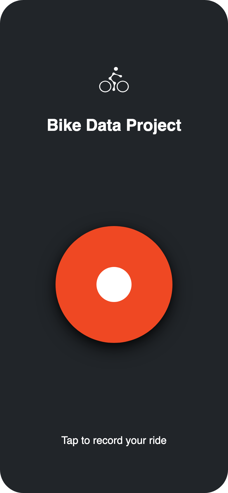
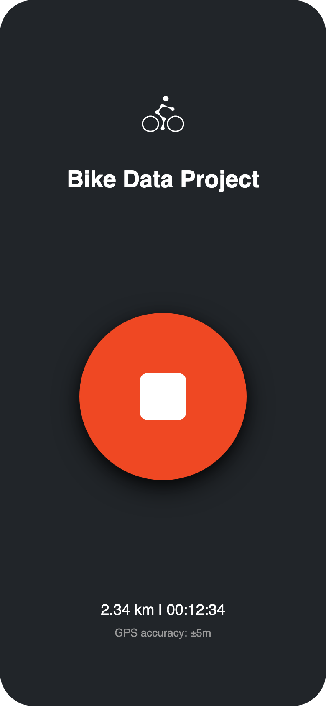
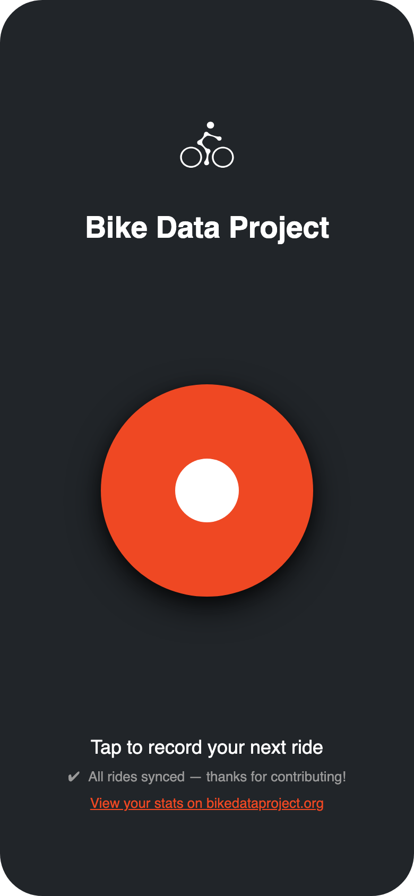

# Bike Data Project Mobile App

[](https://github.com/bikedataproject/mobile-app/actions/workflows/build-android.yml)
[](https://github.com/bikedataproject/mobile-app/releases/latest)

Mobile app for the [Bike Data Project](https://www.bikedataproject.org) that tracks bike rides via GPS and uploads them to the BDP API.

Built with .NET MAUI targeting Android (iOS support planned).

## Screenshots

<p align="center">
  
  
  
</p>

## Features

- **One-tap ride tracking** — tap to record, tap to stop, rides upload automatically
- **Background GPS** with Android foreground service
- **Automatic sync** — rides upload after recording, with periodic retry for failed uploads
- **Offline support** — rides stored locally in SQLite until uploaded
- **Authentication** via OIDC (Authorization Code + PKCE)

## Build

Requires .NET 10 SDK with MAUI workload (`dotnet workload install maui-android`) and Java 17.

```sh
dotnet build src/BDP.App/BDP.App.csproj -f net10.0-android
```

## Publish APK

```sh
dotnet publish src/BDP.App/BDP.App.csproj -c Release -f net10.0-android
```

## CI/CD

The GitHub Actions workflow builds a signed APK on every push to `main`. Tagging a release (`v*`) creates a GitHub Release with the APK attached.
